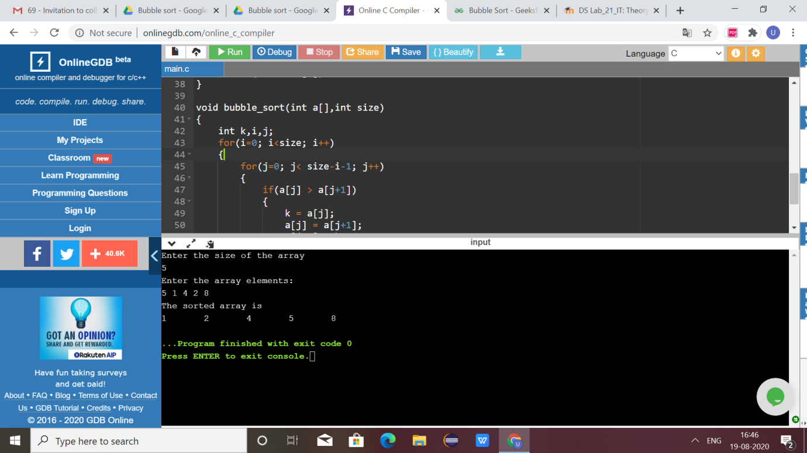

# AIM of the experiment:   
write a  program  that  uses  functions to perform  the bubble   sort

# brief descricripiton about bubble_sort:
Bubble  sort has  three  case:	

Worst and Average Case Time Complexity: O(n*n). Worst case occurs when array is reverse sorted.
Best Case Time Complexity: O(n). Best case occurs when array is already sorted
	
The number of times it passes  is n-1 passes

# Step by  step procedure for the bubble sort :

Bubble Sort is a simple algorithm which is used to sort a given set of n elements provided in form of an array with n number of elements. Bubble Sort compares all the element one by one and sort them based on their values
If the given array has to be sorted in ascending order, then bubble sort will start by comparing the first element of the array with the second element, if the first element is greater than the second element, it will swap both the elements, and then move on to compare the second and the third element, and so on.
If we have total n elements, then we need to repeat this process for n-1 times.
It is known as bubble sort, because with every complete iteration the largest element in the given array, bubbles up towards the last place or the highest index, just like a water bubble rises up to the water surface.
Sorting takes place by stepping through all the elements one-by-one and comparing it with the adjacent element and swapping them if required.
# 1:  out put  with  5  elements

First Pass:
( 5 1 4 2 8 ) –> ( 1 5 4 2 8 ), Here, algorithm compares the first two elements, and swaps since 5 > 1.
( 1 5 4 2 8 ) –>  ( 1 4 5 2 8 ), Swap since 5 > 4
( 1 4 5 2 8 ) –>  ( 1 4 2 5 8 ), Swap since 5 > 2
( 1 4 2 5 8 ) –> ( 1 4 2 5 8 ), Now, since these elements are already in order (8 > 5), algorithm does not swap them.
Second Pass:
( 1 4 2 5 8 ) –> ( 1 4 2 5 8 )
( 1 4 2 5 8 ) –> ( 1 2 4 5 8 ), Swap since 4 > 2
( 1 2 4 5 8 ) –> ( 1 2 4 5 8 )
( 1 2 4 5 8 ) –>  ( 1 2 4 5 8 )
Now, the array is already sorted, but our algorithm does not know if it is completed. The algorithm needs one whole pass without any swap to know it is sorted.
Third Pass:	
( 1 2 4 5 8 ) –> ( 1 2 4 5 8 )
( 1 2 4 5 8 ) –> ( 1 2 4 5 8 )
( 1 2 4 5 8 ) –> ( 1 2 4 5 8 )
( 1 2 4 5 8 ) –> ( 1 2 4 5 8 )
# 2. out put with 10  elements :
 Here the array elements are 1,2,3,4,5,6,7,8,9,10  .   As the   program  it first 
Checks  if it is sorted or not  so , then the array is sorted it is not called the function bubble sort . and it the function checks the condition  for each and
Every element with its adjacent element and swaps at last it prints 1,2,3,4,5,6,7,8,9,10
# 3. output with 3 elements:
Here the array elements 84,34,27  as the program first it checks if it is sorted or not . if the given array is not sorted it is called as bubble sort function. and it the function checks the condition  for each and
Every element with its adjacent element and swaps at last it prints
27,34,84
# output obtained:
(bubble 2.png)(bubble 3.png)

